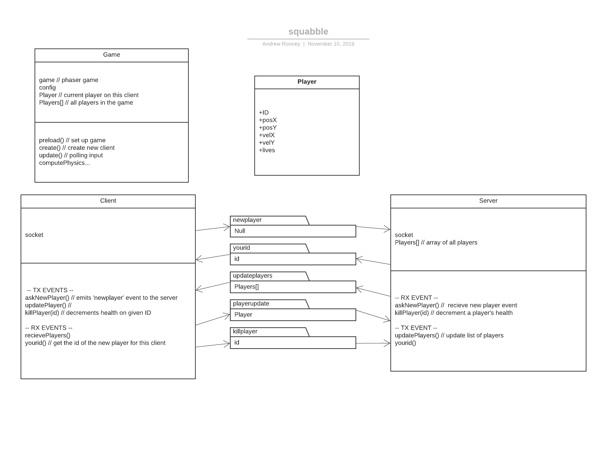

# [Squabble.xyz](http://squabble.xyz)
Submission for the 24 hour hackathon hosted by Startup Edmonton.

## Team Members

* [Ryan Shukla](https://github.com/rpshukla)
* [Eric Claerhout](https://github.com/imswebra)
* [Konrad Staniszewski](https://github.com/KonradStanski)
* [Andrew Rooney](https://github.com/arrooney)
* Taranjot Singh

## Project
For this hackathon, we opted to create an online anonymous .io style multiplayer game. We used Node.js, express on the server side, socket.io for realtime multiplayer client-server information transmission, and phaser3.js for client side game physics and rendering.

## Gameplay
The gameplay is heavily inspired by the simple nature of other .io games, but is meant as a smash bros style brawler with goomba stomp killing mechanics. Stomping on other players increases your jump height allowing you to access further reaches of the game arena.

## Awards
We were awarded 1st place upon completion of this hackathon.

## Running
Inorder to run this app, install npm version 12.0 or greater. `npm install` to install dependencies, then `npm start` or `node ./server.js` to launch to port 8081. Open a browser window to localhost:8081 to play the game locally. Alternatively go to [squabble.xyz](http://squabble.xyz) to play our game.

## UML Design

